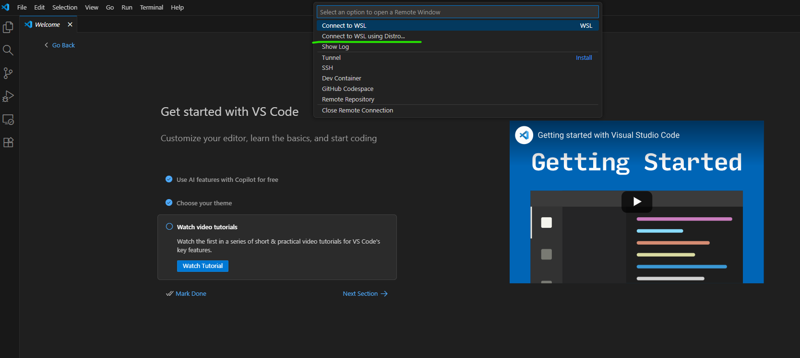
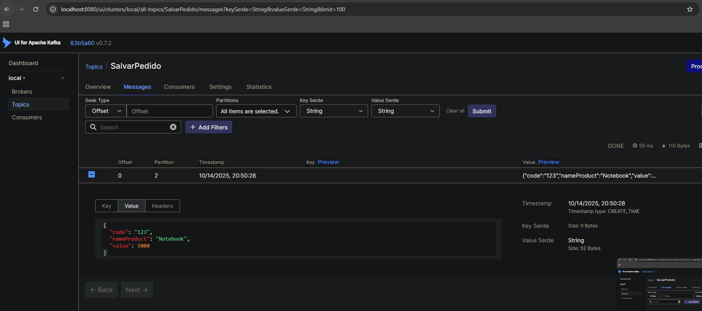

<h1 align="center">Tutorial Spring-Kafka</h1>

Este repositório possui dois projetos demonstrando o funcionamento do Spring com o Kafka, um microservice consumidor e um microservice produtor

<h2 align="left">
    <a href="https://kafka.apache.org/">🔗 Kakfa</a>
</h2>
<h2 align="left">
    <a href="https://spring.io/">🔗 Spring</a>
</h2>
<h2 align="left"> 
	Passo a passo para execução no Windows 🪟 (Para Linux 🐧 executar passo 3, e 6º ao 12º passo)
</h2>

1º Instale o WSL 

2º Instale o Ubuntu via Microsoft Store

3º Instale o Docker dentro da sua distro linux: https://docs.docker.com/engine/install/ubuntu/

4º Abra o Visual Studio Code e instalar o plugin do WSL

5º Pressione Ctrl+Alt+o e selecione a opção Connect to WSL using Distro.
Depois selecione a opção Ubuntu-V*.*.*. Ex:

6º Instale o docker-compose: sudo apt install docker-compose

7º Abra o terminal e adicione seu usuário ao grupo do Docker: sudo usermod -aG docker $USER

8º Clone o projeto dentro da distro Ubuntu disponível via WSL em um diretório qualquer: ex: home/seuusuario/projetos.

9º Após ter feito a instalação do docker, execute o arquivo docker-compose.yml que está na raíz do projeto com o seguinte comando: sudo docker-compose up - d . Feito isso já subimos os containers com uma instancia do Kafka, Zookeeper e Kafka UI.

10º Caso queira visualizar as mensagens que estão sendo enviadas para o tópico do Kafka, utilize o Kafka UI. Acessando: localhost:8080

11º Execute os dois projetos

12º Envie uma requisição post para o projeto produtor com o seguinte curl: curl --request POST \
  --url http://localhost:8081/orders/save \
  --header 'Content-Type: application/json' \
  --header 'User-Agent: insomnia/11.6.1' \
  --data '{"code":"123", 
 "nameProduct": "Notebook",
 "value": 5000 }'

Fim! Até a próxima! 🙂

